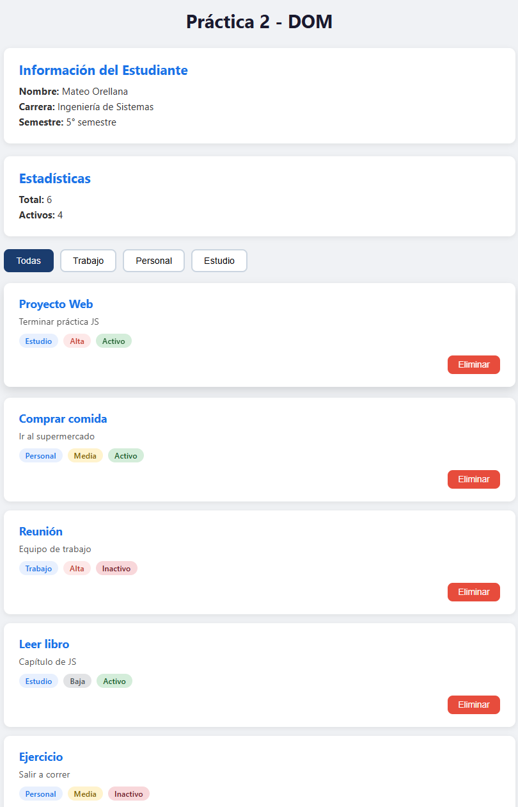
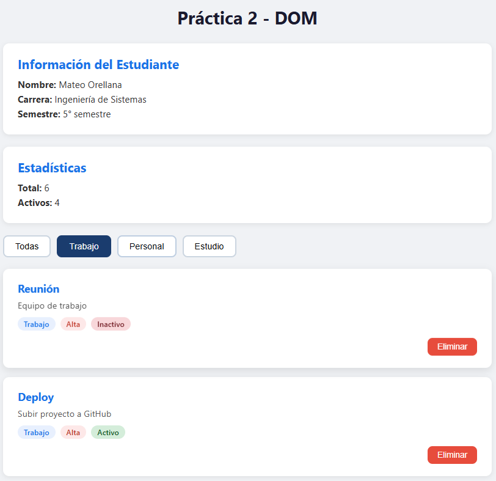

# Práctica 2 - Manipulación del DOM con JavaScript

**Asignatura:** Programación y plataformas web
**Estudiante:** Mateo Orellana  
**Carrera:** Computación  
**Semestre:** 5° ciclo 
**Fecha:** 21 de Abril 2026  

---

## 1. Descripción de la solución

Esta práctica consiste en una aplicación web interactiva desarrollada con HTML, CSS y JavaScript. La aplicación demuestra el manejo del DOM mediante la creación, renderizado y eliminación dinámica de elementos, así como el filtrado de datos por categoría.

La aplicación gestiona una lista de tareas/elementos con las siguientes funcionalidades:

- Visualización de información del estudiante renderizada dinámicamente con JS
- Estadísticas (total de elementos y elementos activos)
- Filtrado de tarjetas por categoría mediante botones interactivos
- Eliminación de elementos del array y actualización inmediata del DOM
- Estilos visuales con badges de prioridad y estado

---

## 2. Estructura del proyecto

```javascript
practica-02/
├── index.html          → Estructura base HTML
├── css/
│   └── styles.css      → Estilos y diseño visual
├── js/
│   └── app.js          → Lógica completa de la aplicación
├── assets/
│   ├── 01-vista-general.png
│   └── 02-filtrado.png
└── README.md
```

---

## 3. Fragmentos de código relevantes

### 3.1 Renderizado de la lista

La función `renderizarLista()` construye cada tarjeta usando `createElement` y asigna
contenido con `textContent`, evitando el uso de `innerHTML` con datos del usuario.
Se utiliza un `DocumentFragment` para optimizar el rendimiento del DOM.

```javascript
function renderizarLista(datos) {
  const contenedor = document.getElementById('contenedor-lista');
  contenedor.innerHTML = '';
  const fragment = document.createDocumentFragment();

  datos.forEach(el => {
    const card = document.createElement('div');
    card.classList.add('card');

    const titulo = document.createElement('h3');
    titulo.textContent = el.titulo;

    const descripcion = document.createElement('p');
    descripcion.textContent = el.descripcion;

    // ... badges y botón de eliminar

    card.appendChild(titulo);
    card.appendChild(descripcion);
    card.appendChild(badges);
    card.appendChild(acciones);
    fragment.appendChild(card);
  });

  contenedor.appendChild(fragment);
  actualizarEstadisticas();
}
```

**¿Por qué este enfoque?**  
Usar `createElement` en lugar de `innerHTML` es más seguro y más legible.

---

### 3.2 Eliminación de elementos

La función `eliminarElemento()` localiza el elemento en el array usando `findIndex`,
lo elimina con `splice` y vuelve a renderizar la lista actualizada.

```javascript
function eliminarElemento(id) {
  const index = elementos.findIndex(el => el.id === id);
  if (index !== -1) {
    elementos.splice(index, 1);
    renderizarLista(elementos);
  }
}
```

Cada botón "Eliminar" registra su propio listener con una arrow function que captura
el `id` del elemento correspondiente mediante closure:

```javascript
btnEliminar.addEventListener('click', () => {
  eliminarElemento(el.id);
});
```

---

### 3.3 Filtrado por categoría

La función `inicializarFiltros()` selecciona todos los botones con `querySelectorAll`
y agrega un evento `click` a cada uno. Al hacer clic, se actualiza la clase activa
y se filtra el array con `.filter()`.

```javascript
function inicializarFiltros() {
  const botones = document.querySelectorAll('.btn-filtro');
  botones.forEach(btn => {
    btn.addEventListener('click', () => {
      botones.forEach(b => b.classList.remove('btn-filtro-activo'));
      btn.classList.add('btn-filtro-activo');

      const categoria = btn.dataset.categoria;
      if (categoria === 'todas') {
        renderizarLista(elementos);
      } else {
        const filtrados = elementos.filter(e => e.categoria === categoria);
        renderizarLista(filtrados);
      }
    });
  });
}
```

---

### 3.4 Información del estudiante y estadísticas

```javascript
function mostrarInfoEstudiante() {
  document.getElementById('estudiante-nombre').textContent = estudiante.nombre;
  document.getElementById('estudiante-carrera').textContent = estudiante.carrera;
  document.getElementById('estudiante-semestre').textContent =
    `${estudiante.semestre}° semestre`;
}

function actualizarEstadisticas() {
  document.getElementById('total-elementos').textContent = elementos.length;
  document.getElementById('elementos-activos').textContent =
    elementos.filter(el => el.activo).length;
}
```

---

## 4. Capturas de pantalla

### 4.1 Vista general de la aplicación

Muestra la aplicación con todas las tarjetas cargadas, la información del estudiante,
las estadísticas y los botones de filtro.



---

### 4.2 Filtrado aplicado

Al presionar el botón "Estudio", se muestran únicamente las tarjetas pertenecientes
a esa categoría. El botón activo se resalta visualmente con un fondo oscuro.



---

## 5. Conclusiones

- Se aplicó correctamente la selección de elementos del DOM con `getElementById`
  y `querySelectorAll`.
- Se construyeron elementos dinámicamente con `createElement` y `appendChild`,
  siguiendo buenas prácticas de seguridad web.
- El uso de `DocumentFragment` permite insertar múltiples nodos en una sola operación,
  mejorando el rendimiento.
- El filtrado con `.filter()` y la eliminación con `findIndex` + `splice` demuestran
  el manejo efectivo de arrays en JavaScript.
- Los eventos fueron registrados correctamente con `addEventListener`, evitando
  el uso de atributos `onclick` en el HTML.