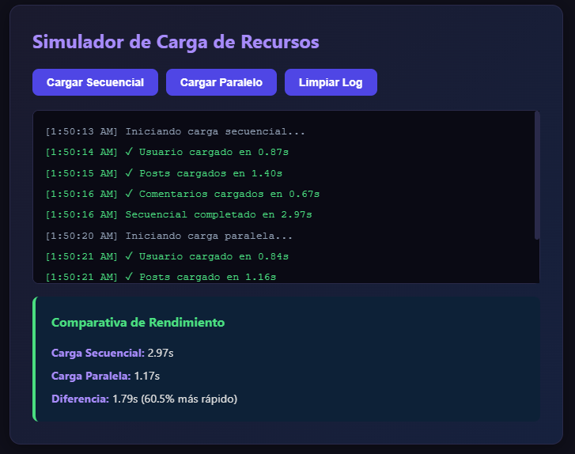
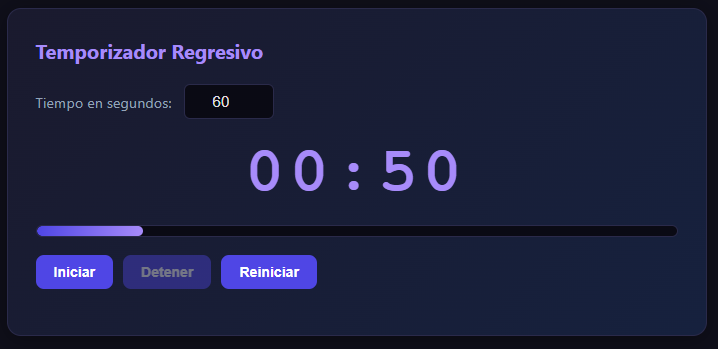
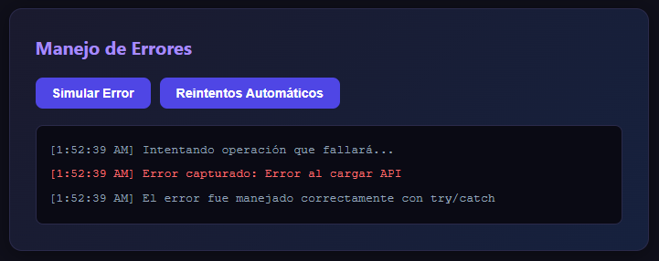

# Práctica 5 - Asincronía en JavaScript

**Asignatura:** Programación y plataformas web
**Estudiante:** Mateo Orellana  
**Carrera:** Computación  
**Semestre:** 5° ciclo 
**Fecha:** 21 de Abril 2026   

---

## 1. Descripción de la solución

Esta práctica implementa tres módulos que demuestran el manejo de operaciones
asíncronas en JavaScript.

El **simulador de carga de recursos** compara visualmente la diferencia entre
ejecutar peticiones de forma secuencial (una tras otra con `await` consecutivos)
versus paralela (todas simultáneas con `Promise.all`). Cada "petición" es una
promesa que resuelve después de un delay aleatorio con `setTimeout`, imitando
el comportamiento real de llamadas a una API.

El **temporizador regresivo** usa `setInterval` para decrementar un contador
cada segundo, actualizando en tiempo real un display en formato MM:SS y una
barra de progreso animada. Incluye alertas visuales cuando el tiempo se agota.

El **módulo de manejo de errores** demuestra el uso de bloques `try/catch` con
promesas rechazadas y un sistema de reintentos automáticos con backoff
exponencial, que aumenta el tiempo de espera entre cada intento fallido.

---

## 2. Estructura del proyecto

```javascript
practica-05/
├── index.html              → Estructura HTML con las 3 secciones
├── css/
│   └── styles.css          → Estilos oscuros estilo terminal
├── js/
│   └── app.js              → Lógica asíncrona completa
├── assets/
│   ├── 01-comparativa.png
│   ├── 02-temporizador.png
│   └── 03-error.png
└── README.md
```

---

## 3. Código destacado

### 3.1 Función que retorna una promesa con `setTimeout`

Esta función base simula una petición HTTP real. Crea y retorna una `Promise`
manualmente: si `fallar` es `true` la rechaza con un error; si es `false` la
resuelve con los datos del recurso después de un delay aleatorio.

```javascript
function simularPeticion(nombre, tiempoMin = 500, tiempoMax = 2000, fallar = false) {
  return new Promise((resolve, reject) => {
    const tiempoDelay =
      Math.floor(Math.random() * (tiempoMax - tiempoMin + 1)) + tiempoMin;

    setTimeout(() => {
      if (fallar) {
        reject(new Error(`Error al cargar ${nombre}`));
      } else {
        resolve({
          nombre,
          tiempo: tiempoDelay,
          timestamp: new Date().toLocaleTimeString()
        });
      }
    }, tiempoDelay);
  });
}
```

El tiempo total de ejecución depende del modo: en secuencial es la **suma**
de todos los delays; en paralelo es solo el delay **más largo**.

---

### 3.2 Carga secuencial con `await` consecutivos

Cada `await` pausa la ejecución de la función hasta que la promesa anterior
se resuelve. Las tres peticiones se ejecutan estrictamente una tras otra,
por lo que el tiempo total es aproximadamente la suma de los tres delays
individuales (entre 4 y 6 segundos).

```javascript
async function cargarSecuencial() {
  const inicio = performance.now();
  try {
    const usuario = await simularPeticion('Usuario', 500, 1000);
    mostrarLog(`✓ ${usuario.nombre} cargado en ${formatearTiempo(usuario.tiempo)}`, 'success');

    const posts = await simularPeticion('Posts', 700, 1500);
    mostrarLog(`✓ ${posts.nombre} cargados en ${formatearTiempo(posts.tiempo)}`, 'success');

    const comentarios = await simularPeticion('Comentarios', 600, 1200);
    mostrarLog(`✓ ${comentarios.nombre} cargados en ${formatearTiempo(comentarios.tiempo)}`, 'success');

    const total = performance.now() - inicio;
    tiempoSecuencial = total;
    mostrarLog(`Secuencial completado en ${formatearTiempo(total)}`, 'success');
  } catch (error) {
    mostrarLog(`Error: ${error.message}`, 'error');
  }
}
```

---

### 3.3 Carga paralela con `Promise.all`

Las tres promesas se crean **sin `await`**, lo que hace que todas inicien
al mismo tiempo. `Promise.all` espera a que todas resuelvan antes de
continuar. El tiempo total es aproximadamente el delay de la petición
más lenta (entre 1 y 2 segundos), independientemente de las demás.

```javascript
async function cargarParalelo() {
  const inicio = performance.now();
  try {
    // Las 3 promesas arrancan simultáneamente
    const promesas = [
      simularPeticion('Usuario',     500, 1000),
      simularPeticion('Posts',       700, 1500),
      simularPeticion('Comentarios', 600, 1200)
    ];

    // Espera a que TODAS terminen
    const resultadosPromesas = await Promise.all(promesas);

    resultadosPromesas.forEach((resultado) => {
      mostrarLog(
        `✓ ${resultado.nombre} cargado en ${formatearTiempo(resultado.tiempo)}`,
        'success'
      );
    });

    const total = performance.now() - inicio;
    tiempoParalelo = total;
    mostrarLog(`Paralelo completado en ${formatearTiempo(total)}`, 'success');
  } catch (error) {
    mostrarLog(`Error: ${error.message}`, 'error');
  }
}
```

---

### 3.4 Manejo de errores con `try/catch`

El bloque `try` intenta ejecutar una promesa que siempre fallará. Cuando
la promesa es rechazada, el control pasa al bloque `catch`, que captura
el error y lo muestra en la interfaz sin romper la aplicación ni generar
errores en la consola del navegador.

```javascript
async function simularError() {
  mostrarLogError('Intentando operación que fallará...', 'info');
  try {
    await simularPeticion('API', 500, 1000, true); // fallar = true
    mostrarLogError('✓ Operación exitosa', 'success');
  } catch (error) {
    mostrarLogError(`Error capturado: ${error.message}`, 'error');
    mostrarLogError('El error fue manejado correctamente con try/catch', 'info');
  }
}
```

El sistema de reintentos con **backoff exponencial** aumenta progresivamente
el tiempo de espera entre intentos: 500ms, 1000ms y 2000ms. Esto evita
saturar un servidor que podría estar temporalmente sobrecargado.

```javascript
async function fetchConReintentos(nombre, intentos = 3) {
  for (let i = 0; i < intentos; i++) {
    try {
      mostrarLogError(`Intento ${i + 1}/${intentos}...`, 'info');
      const resultado = await simularPeticion(nombre, 500, 1000, Math.random() > 0.5);
      mostrarLogError(`✓ Éxito en intento ${i + 1}: ${nombre} cargado`, 'success');
      return resultado;
    } catch (error) {
      mostrarLogError(`Intento ${i + 1} falló: ${error.message}`, 'error');
      if (i < intentos - 1) {
        const espera = Math.pow(2, i) * 500; // 500ms → 1000ms → 2000ms
        mostrarLogError(`Esperando ${espera}ms antes del siguiente intento...`, 'warning');
        await new Promise(resolve => setTimeout(resolve, espera));
      }
    }
  }
  throw new Error(`No se pudo cargar ${nombre} después de ${intentos} intentos`);
}
```

---

### 3.5 Temporizador con `setInterval` y `clearInterval`

`setInterval` ejecuta una función cada 1000ms (1 segundo). El ID que retorna
se guarda en `intervaloId` para poder cancelarlo con `clearInterval` al
detener o reiniciar. El botón Iniciar se deshabilita para evitar crear
múltiples intervalos en paralelo, lo que causaría que el tiempo avance
más rápido de lo esperado.

```javascript
function iniciar() {
  if (intervaloId) return; // Evita múltiples intervalos

  tiempoRestante       = parseInt(inputTiempo.value);
  tiempoInicial        = tiempoRestante;
  btnIniciar.disabled  = true;
  btnDetener.disabled  = false;
  inputTiempo.disabled = true;

  actualizarDisplay(); // Actualizar inmediatamente sin esperar 1s

  intervaloId = setInterval(() => {
    tiempoRestante--;
    actualizarDisplay();

    if (tiempoRestante <= 0) {
      detener();
      display.classList.add('alerta');
      alert('¡Tiempo terminado!');
    }
  }, 1000);
}

function detener() {
  if (intervaloId) {
    clearInterval(intervaloId); // Cancela el intervalo activo
    intervaloId          = null;
    btnIniciar.disabled  = false;
    btnDetener.disabled  = true;
    inputTiempo.disabled = false;
  }
}
```

---

## 4. Análisis: Secuencial vs Paralelo

La diferencia entre ambos enfoques es significativa cuando las operaciones
son independientes entre sí (no necesitan el resultado de la anterior para
ejecutarse).

| Modo | Tiempo aproximado | Cómo funciona |
|---|---|---|
| Secuencial | 1.8s + 1.2s + 0.9s = **3.9s** | Espera que termine cada `await` |
| Paralelo | `max(1.8s, 1.2s, 0.9s)` = **1.8s** | Todas corren al mismo tiempo |
| Mejora | ~**54% más rápido** | Solo paga el costo del más lento |

En aplicaciones reales, cargar en paralelo con `Promise.all` es preferible
siempre que las peticiones sean independientes (por ejemplo, cargar usuario,
posts y comentarios al mismo tiempo al abrir una página). La carga secuencial
solo es necesaria cuando una operación depende del resultado de la anterior
(por ejemplo, primero obtener el ID de usuario y luego usarlo para pedir sus posts).

---

## 5. Capturas de pantalla

### 5.1 Comparativa secuencial vs paralelo

Ambas cargas ejecutadas con los tiempos individuales en el log y el cuadro
de comparativa mostrando el porcentaje de mejora de la carga paralela.



---

### 5.2 Temporizador funcionando con barra de progreso

Display en formato MM:SS actualizándose cada segundo con la barra de progreso
creciendo de izquierda a derecha. Al llegar a 10 segundos o menos, el display
y la barra cambian a rojo con animación de pulso.



---

### 5.3 Error capturado y mostrado en la interfaz

Log de la sección de errores mostrando el error capturado por `try/catch`
y el sistema de reintentos con los tiempos de espera del backoff exponencial.



---

## 6. Conclusiones

- Las promesas con `setTimeout` permiten simular el comportamiento real de
  peticiones a APIs sin necesidad de un servidor, facilitando el aprendizaje
  de asincronía.
- `async/await` hace que el código asíncrono sea legible como si fuera
  síncrono, sin anidar callbacks ni encadenar `.then()`.
- `Promise.all` es la herramienta correcta para peticiones independientes:
  puede reducir el tiempo total entre un 50% y 70% respecto a la ejecución
  secuencial.
- `try/catch` con `async/await` captura errores de promesas rechazadas de
  forma limpia, evitando que los errores rompan la aplicación.
- `setInterval` requiere guardar su ID para poder cancelarlo con `clearInterval`.
  Sin esta práctica, se acumulan intervalos en memoria que causan comportamientos
  inesperados.
- El backoff exponencial es un patrón profesional usado en producción para
  reintentos: evita saturar servicios que están bajo carga temporal.